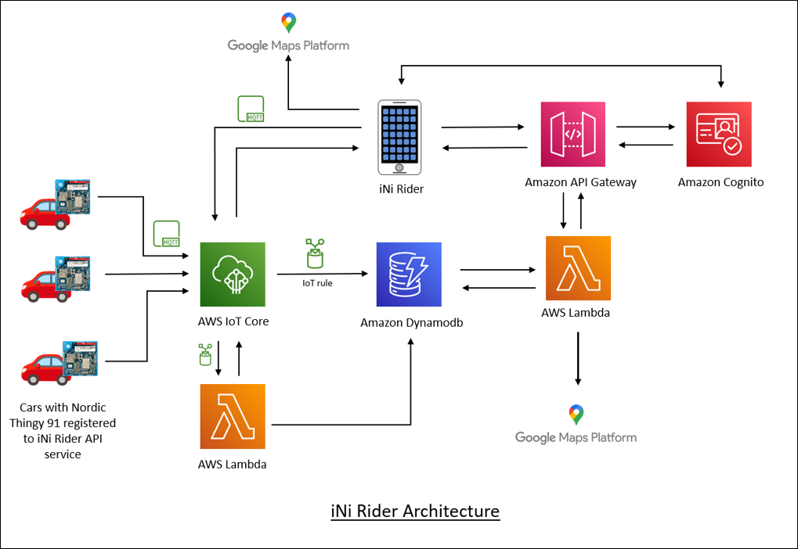

# iNi Rider API Service

iNi Rider is a car ride sharing / pooling application built using flutter utilising the GPS capabilities of the Nordic Thingy 91 to collect the location coordinates of the cars. The iNi Rider API is a backend service that collects and manages the data required for the iNi Rider application.

# Architecture

Nordic Semiconductor's [Nordic Thingy:91](https://www.nordicsemi.com/Products/Development-hardware/Nordic-Thingy-91) multi-sensor prototyping kit is ideal for cellular IoT projects using the nRF9160 system-in-package (SiP).By integrating an application processor, multimode LTE-M/NB-IoT/GNSS modem, RF front-end (RFFE) and power management in a 10x16x1.04 mm
package, it offers the most compact solution for cellular IoT (cIoT) on the market.

The location of the car is collected using the Nordic Thingy 91 via MQTT protocol to AWS IoT Core to showcase the capabilities of the nRF9160 cellular IoT System-in-Package.

The iNi Rider API service is built using the following services:
* Amazon Cognito
  * The Cognito provides a secure user identity management and authentication services for the service users. The email verification is disabled in the MVP release and all the registered users are confirmed by default for now.
* Amazon DynamoDB
  * The DynamoDB provides managed NoSQL database service to persist the service data.
* Amazon API Gateway
  * Amazon API Gateway is an AWS service for creating, publishing, maintaining, monitoring, and securing REST, HTTP, and WebSocket APIs at any scale. 
* AWS Lambda 
  * AWS Lambda is an event-driven, serverless computing platform provided by Amazon as a part of Amazon Web Services. It is a computing service that runs code in response to events and automatically manages the computing resources required by that code.
* AWS IoT Core
  * AWS IoT Core is a managed cloud service that lets connected devices easily and securely interact with cloud applications and other devices.
* Google Maps Platform
  * Google maps platform APIs are used to get the directions and resolve the geodirections in both the API service and mobile application.  
  
  
 

Please refer the specific sections formore details:

- [Getting Started](doc/GettingStarted.md)
- [AWS IoT Core](doc/AWSIoTCore.md)
- [Location Tracking](doc/LocationTracking.md)
- [Nordic Thingy:91](doc/Thingy91Setup.md)
- [REST APIs](doc/RESTAPIs.md)

**Limitations**
- The application test coverage is very limited (only to users endpoint) due to the time limitations.
- The code can be still optimised / improved to fix the performance and reliablity issues.

**Attribution**

Thanks to *Saravanan Dhanabal*, *Indhira Piriyadharshini Marimuthu* for your support in this project.
