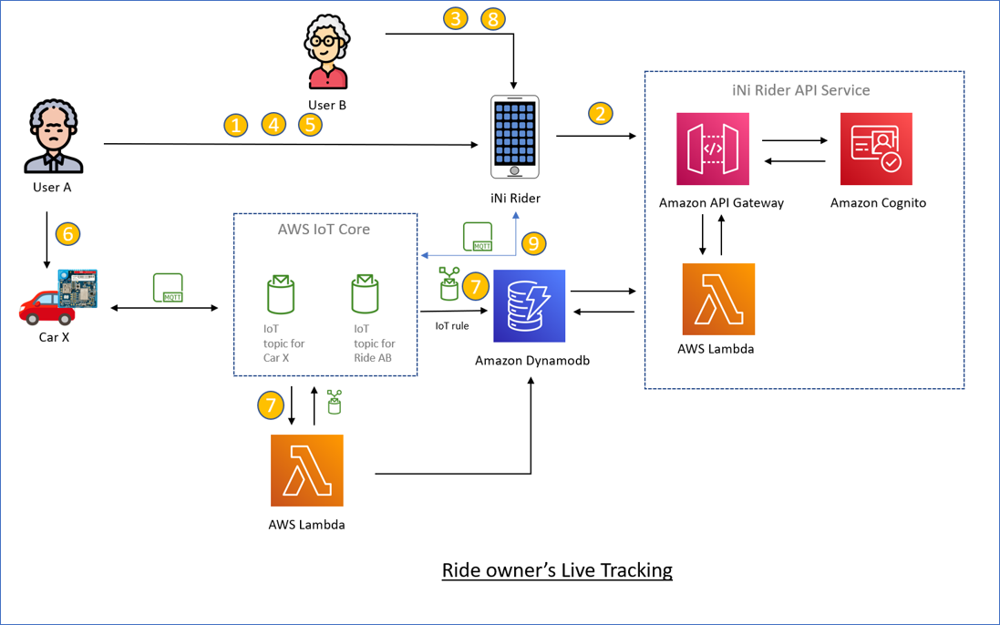

# Location tracking
The location data is collecting using MQTT from the Nordic Thingy 91 to AWS IoT core and persisted to Dynamodb for the future use. The live tracking is enabled by subscribing to the MQTT topic ($aws/things/**Thingy91-IMEI-number**/shadow/update) from the mobile application.

Let's go through two scenarios where location tracking is enabled in the application.

## Car live tracking

1. The User A registers his car with the iNi Rider application.
2. The iNi rider registers the car with the iNi Rider service deployed to AWS.
3. The User A installs the necessary device certificates and the tracking application built for use to connect to the iNi Rider Service.
4. The Thingy 91 linked to the Car X starts pushing the GNSS data with the location coordinates to the AWS IoT Core endpoint via MQTT.
5. The AWS IoT Core forwards the notifications to two destinations based on the IoT rules.
    - persists the location data in the DynamoDB
    - invokes a AWS Lambda function which forwards the nottifications to the ongoing rides topics if any as agreeed with the owner of the car.
6. The User A tries to track his car using the iNi Rider application.
7. The iNi Rider application establishes a MQTT subscription to the same topic ($aws/things/**Thingy91-IMEI-number**/shadow/update) to consume the location updates and displays the location in the application.

## Ride live tracking

1. The User A has a registered car and publishes a ride offer in the iNi Rider application with the source, destination, time and available seats for the ride.
2. The iNi Rider application persists the ride offer in the iNi Rider service.
3. The User B interested to join the User A and adds a request to the offer with the ource, destination, time and required seats.
4. The User A reviews the request and approves the request from User B.
5. The user A marks the ride as ongoing when he starts the ride.
6. The iNi Rider application pupblishes the status change to the iNi Rider API service.
7. The iNi Rider API service 
   - marks all the approved requests (including the request from User B) as ongoing.
   - adds a mapping of the User A's Imei number to the ride offer identifier in the DynamoDB.
8. The AWS IoT Core starts to forward the location updates published to the MQTT topic for the Car X to two desintations.
    - persists the location data in the DynamoDB
    - invokes a AWS Lambda function which forwards the nottifications to the ongoing rides topics as found in the DynamoDB data. 
9. The User B tries to track the User A's car to join the ride using the iNi Rider application.
10. The iNi Rider application establishes a MQTT subscription to the ride topic (rides/**ride-offer-id**/shadow/update) to consume the location updates and displays the location in the application.

Note: The User A's Imei number to the ride mappings in the DynamoDB will be removed when the User A changes his ride offer status from the **ongoing** to **completed**. Then the User B can longer receive the location updates from the User A's car as the ride is completed already.

