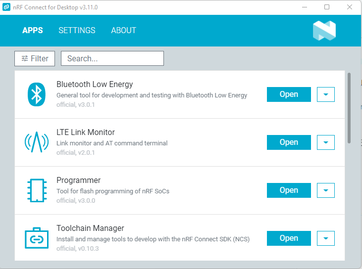
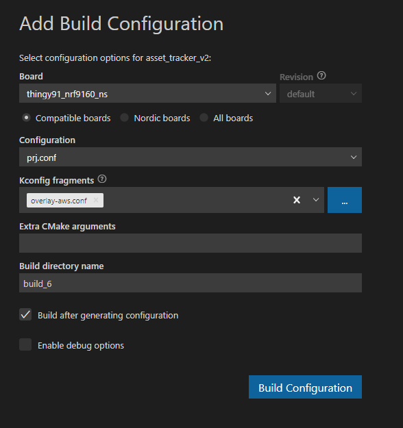
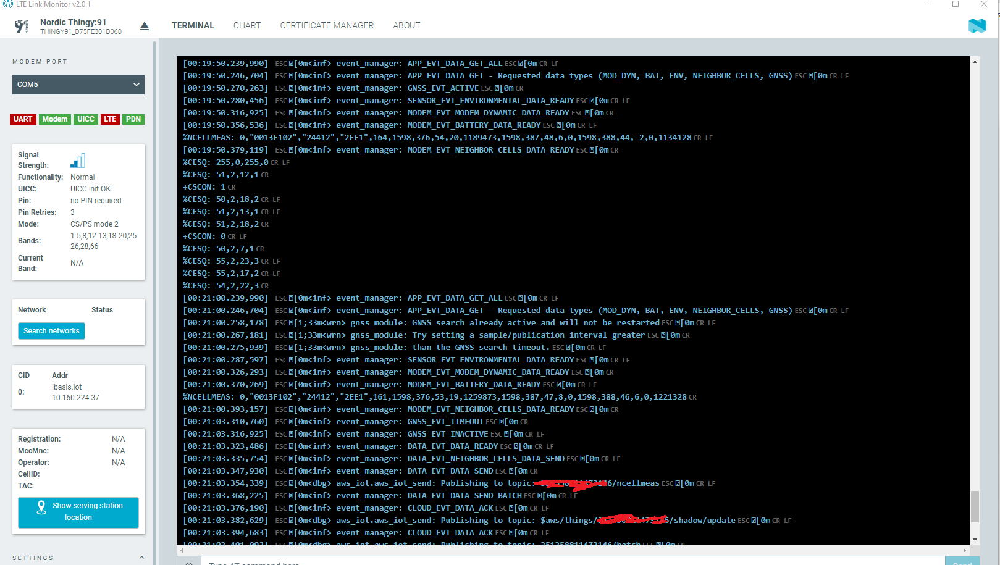

# Nordic Thingy:91 Device setup

Nordic Semiconductor's [Nordic Thingy:91](https://www.nordicsemi.com/Products/Development-hardware/Nordic-Thingy-91) multi-sensor prototyping kit is ideal for cellular IoT projects using the nRF9160 system-in-package (SiP).By integrating an application processor, multimode LTE-M/NB-IoT/GNSS modem, RF front-end (RFFE) and power management in a 10x16x1.04 mm
package, it offers the most compact solution for cellular IoT (cIoT) on the market.

The location of the car is collected using the Nordic Thingy:91 via MQTT protocol to AWS IoT Core to showcase the capabilities of the nRF9160 cellular IoT System-in-Package. Inorder to use the Thingy:91 with iNi Rider API service, we need to configure the device using the below steps:

## nRF Connect for Desktop
Install the [nRF Connect for Desktop](https://www.nordicsemi.com/Products/Development-tools/nRF-Connect-for-desktop) for your operating system. 

After the installation, launch the nRF Connect for Desktop and install the additional apps *Programmer* and *LTE Link Monitor*.




## Thing:91 initial setup
Follow the basic setup instructions in the [YouTube video](https://youtu.be/xQ7hDzRULJQ) to get the device up and running. Once the initial setup is done and the device is working, let's start configure the device for our usecase.

**Install certificates**
1. Connect the Thingy:91 to the computer with a USB cable.
2. Launch the LTE Link Monitor 
3. Type the command *AT+CFUN=4* to switch off the modem.
4. Open the *CERTIFICATE MANAGER*.
3. Copy the certificates downloaded from AWS as explained in [AWS IoT Core Configuration](AWSIoTCore.md#create-thing--device-certificate) document..
4. Update the ceritificates and note down the Security tag value.
5. Restart the Thingy:91 to bring the modem online.

## asset-tracker-v2 application
Open the asset_tracker_v2 application in Visual Studio Code. You can find the application in the path: *nrf-connect desktop-location*\v1.9.1\nrf\applications\asset_tracker_v2 

Update the *overlay-aws.conf* in the root folder as shown below:
```
CONFIG_AWS_IOT=y
CONFIG_AWS_IOT_TOPIC_UPDATE_DELTA_SUBSCRIBE=y
CONFIG_AWS_IOT_TOPIC_GET_REJECTED_SUBSCRIBE=y
CONFIG_AWS_IOT_AUTO_DEVICE_SHADOW_REQUEST=y
CONFIG_AWS_IOT_MQTT_RX_TX_BUFFER_LEN=2048
CONFIG_AWS_IOT_APP_SUBSCRIPTION_LIST_COUNT=3
CONFIG_AWS_IOT_CLIENT_ID_APP=y
#CONFIG_AWS_FOTA=y

# Options that must be configured in order to establish a connection.
CONFIG_AWS_IOT_SEC_TAG=<security tag noted from LTE Link Monitor's CERTIFICATE MANAGER>
CONFIG_AWS_IOT_BROKER_HOST_NAME="<AWS IoT endpoint name>"
CONFIG_AWS_IOT_LOG_LEVEL_DBG=y
CONFIG_AWS_IOT_CLIENT_ID_STATIC="<random identifier for AWS>"

# MQTT Transport library
# Maximum specified MQTT keepalive timeout for AWS IoT is 1200 seconds.
CONFIG_MQTT_KEEPALIVE=1200

# This is modified to reduce the location update notifications frequencey
# Setting this to less than the value configured for CONFIG_DATA_GNSS_TIMEOUT_SECONDS (60 seconds)
# resulted in GNSS search failures 
CONFIG_DATA_ACTIVE_TIMEOUT_SECONDS=70
```

Build the application using the configuration as shown below: 



Flash the application binary (asset_tracker_v2\build_5\zephyr\app_signed.hex) using the *Programmer* application. Ensure the Thingy:91 is in MCUBoot mode before you start flashing the application.

Restart the Thingy:91 and follow the LTE Monitor logs. The logs should indicate successful MQTT message deliveries to the AWS.




